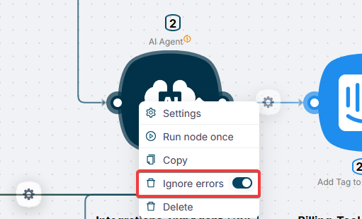

import { Callout } from 'fumadocs-ui/components/callout';

# Ignoring Errors

By default, if a node fails, the scenario stops. The **Ignore Errors** option changes this behavior: the scenario continues running even if the node fails. Any data taken from that node will return `null`.

This is useful when working with unstable APIs, or when a single node failure should not block the rest of the scenario.

## How it works

When the option is enabled and a node fails:

- the scenario **does not stop** — subsequent nodes continue executing
- all data from the failed node returns **`null`**
- the error is **recorded** in the execution history — you can still review it

## When to use

- **Unstable APIs** — the service occasionally returns errors, but this is not critical for the result
- **Error notifications** — you want to send yourself an alert when a node fails, but the scenario should keep running
- **Optional steps** — some steps in the scenario are not essential and their failure does not affect the final result

<Callout type="warning">
If downstream nodes use data from the failed node, they will receive `null`. Make sure your scenario handles these values correctly.
</Callout>

## Setup

Open the node's advanced settings and enable **Ignore Errors**.

## See also

- [Node Restart on Error](/visual-builder/error-handling/node-restart-on-error) — automatically retry the request when the API returns an error (500, timeout, 429)
- [Node Restart on Incorrect Response](/visual-builder/error-handling/node-restart-on-incorrect-response) — retry the request until the API returns the expected result
