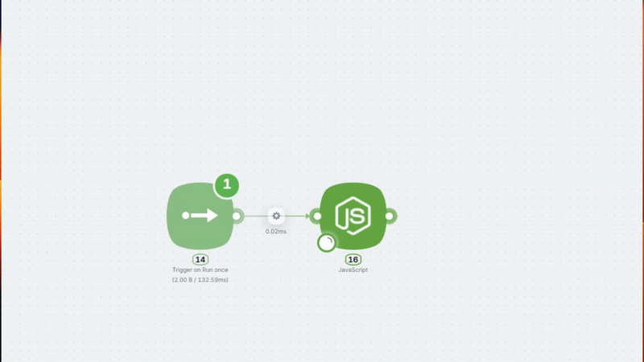
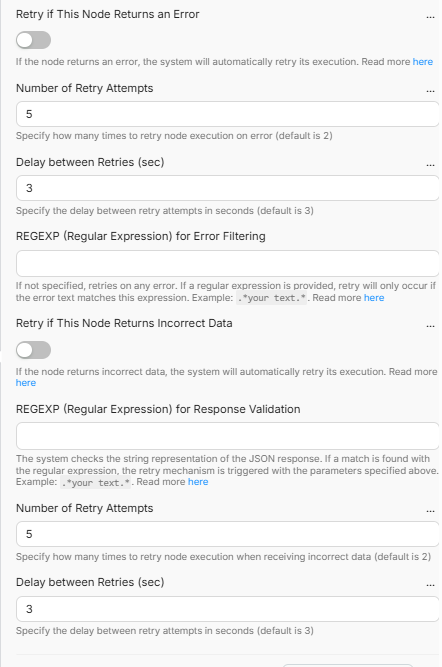

import { Callout } from 'fumadocs-ui/components/callout';
import { Cards, Card } from 'fumadocs-ui/components/card';

# Node Restart on Error

All action nodes on Latenode include **Retry if This Node Returns an Error** in the advanced settings. This option lets the system automatically restart the node and retry the request when the service returns an error.

## When You Need This

The service you're calling returns an error — 500, 503, timeout, 429 "Too Many Requests", etc.

Normally, this would stop your scenario. With retry enabled, the system automatically repeats the request a specified number of times with a defined pause between attempts.

**When to use this:**

- API sometimes responds with 500 or 503
- Timeouts occur during high load
- Service returns 429 when rate limit is exceeded

## Configuration

**Retry if This Node Returns an Error** — enable automatic retry when the node throws an error.

**Number of Retry Attempts** — how many times to retry the request (default: 2).

**Delay between Retries (sec)** — pause between attempts in seconds (default: 3).

**REGEXP (Regular Expression)** — optionally filter which errors trigger a retry. By default, any error triggers a retry. If you set a pattern, only errors matching it will cause a restart.

**Important:** Without `.*`, the pattern only matches if the entire error message exactly equals your word. Always write `.*(your_pattern).*`

### Pattern Examples

| Use Case | Pattern |
|----------|---------|
| Retry only on 500 errors | `.*500.*` |
| Retry on 500 or 503 | `.*(500\|503).*` |
| Retry on timeouts | `.*timeout.*` |
| Retry on rate limit (429) | `.*429.*` |
| Retry on 5xx errors | `.*5\d\d.*` |

Uses the **Go (RE2)** regular expression engine. Supported: `\d`, `\s`, `\w`, `|`, `()`. Not supported: lookahead `(?=...)` and lookbehind `(?<=...)`.

<Callout type="info">
For regular API errors, 2–3 attempts with a 3–5 second delay are usually enough.
</Callout>

## What's Next

<Cards>
  <Card href="/visual-builder/error-handling/node-restart-on-incorrect-response" title="Node Restart on Incorrect Response (Polling)">
    Retry the request until the API returns the expected result (e.g. status completed).
  </Card>
  <Card href="/visual-builder/possible-errors" title="Possible Errors">
    Common errors in scenarios and how to fix them
  </Card>
</Cards>
