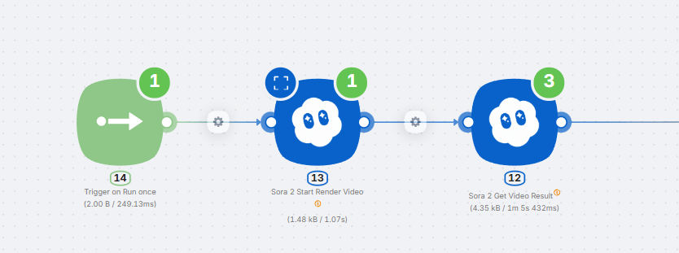
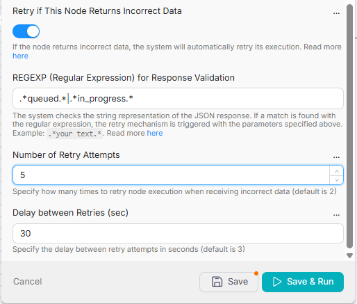
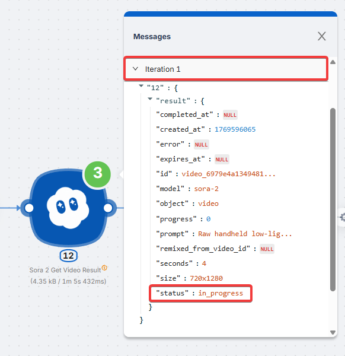
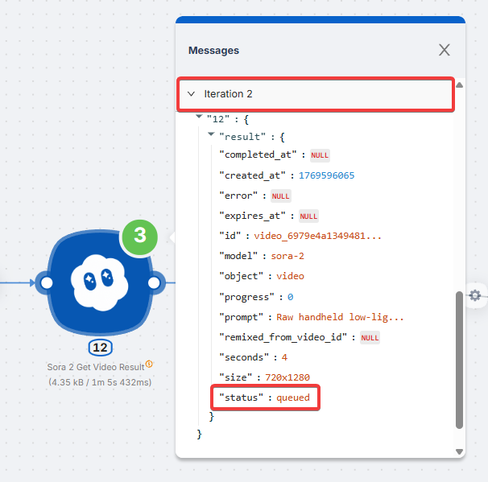
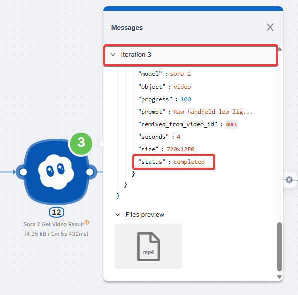

import { Callout } from 'fumadocs-ui/components/callout';
import { Cards, Card } from 'fumadocs-ui/components/card';

# Node Restart on Incorrect Response (Polling)

The API responds successfully (status 200), but the task is still processing. With **Retry if This Node Returns Incorrect Data** enabled, the node restarts after a set delay while the response contains "trigger" words (e.g. `queued`, `processing`). Once the response no longer contains them, the node completes and passes the result forward.

This is especially useful for content generation — video, audio, images, documents.

## When to Use This

- Working with "Get Result" type nodes: one node starts the process and returns an ID, another retrieves the result later
- Applicable to almost all AI services (except text-based ones)

Typical example — video generation API:

```json
// First request — task queued
{"status": "queued", "id": "abc123"}

// After 5 seconds — processing
{"status": "processing", "id": "abc123"}

// After 10 seconds — done!
{"status": "completed", "url": "https://..."}
```

You need to wait for `completed` with a ready file link. You specify trigger words (`queued`, `processing`) — while they're present in the response, the node restarts after the specified time. Once `completed` arrives (without trigger words), the node completes successfully.

**Enable:** **Retry if This Node Returns Incorrect Data**

<Callout type="info">
For content generation (video, audio, images): use 5–10 attempts with 20–30 second delays.
</Callout>

## Configuration

**Retry if This Node Returns Incorrect Data** — enable automatic retry when the response doesn't match the expected pattern.

**Number of Retry Attempts** and **Delay between Retries (sec)** — how often to poll the API (see [Node Restart on Error](/visual-builder/error-handling/node-restart-on-error)).

**REGEXP (Regular Expression)** — you specify **trigger words**: if they're found in the response, the node restarts after the specified time. If no trigger words are found — success, the node completes and passes the result forward.

**Important:** Without `.*`, the pattern only matches if the entire response exactly equals your word. Always write `.*(your_pattern).*`

### Pattern Examples

| Use Case | Pattern |
|----------|---------|
| Restart while status is `queued` | `.*queued.*` |
| Restart while `queued` or `pending` | `.*(queued\|pending).*` |
| Restart during processing | `.*(queued\|pending\|processing\|in_progress).*` |
| Restart while `ready` = false | `.*"ready":\s*false.*` |

## Example: Waiting for Video Generation



**Task:** A video generation API first returns `in_progress`, then `queued`, and finally `completed` with a ready link.

**Configuration:**



1. Enable **Retry if This Node Returns Incorrect Data**
2. REGEXP: `.*(in_progress|queued).*`
3. Number of Retry Attempts: 5
4. Delay between Retries (sec): 30

**How it works:**



- **Iteration 1:** `"status": "in_progress"` — contains trigger word. Node restarts in 30 seconds.



- **Iteration 2:** `"status": "queued"` — contains trigger word. Node restarts in 30 seconds.



- **Iteration 3:** `"status": "completed"` — no trigger words. Node completes, result (video) is passed to the next node.

The node restarts every 30 seconds until it receives a response without trigger words. Once a successful response arrives, data is passed to the scenario.

## Technical Details

- Uses **Go (RE2)** regular expression engine
- Supported: `\d`, `\s`, `\w`, `|`, `()`
- Not supported: lookahead `(?=...)` and lookbehind `(?<=...)`

## What's Next

<Cards>
  <Card href="/visual-builder/error-handling/node-restart-on-error" title="Node Restart on Error">
    Retry the request when the API returns an error (500, timeout, 429)
  </Card>
  <Card href="/visual-builder/error-handling/ignoring-errors" title="Ignoring Errors">
    Continue the scenario when a node fails
  </Card>
</Cards>
