# Interface

The **Scenarios** page is where you view, organize, and manage your scenarios and folders.

---

## Scenarios and folders

Existing scenarios are available on the **Scenarios** page. You can also organize scenarios into folders (including nested subfolders).

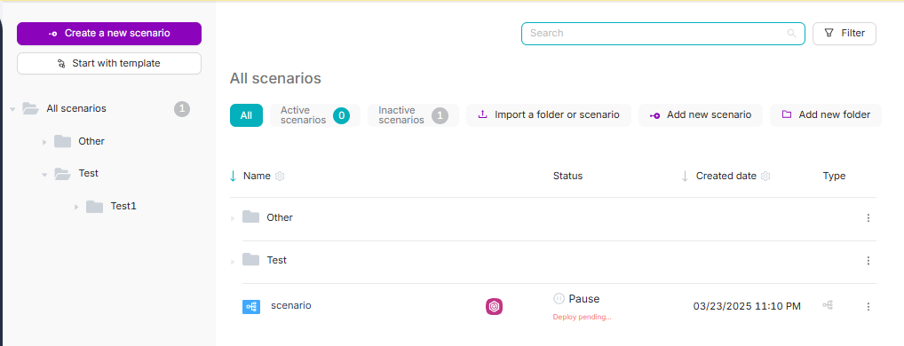

### Create a folder and move a scenario

1. Click **Add new folder** and enter the folder name.

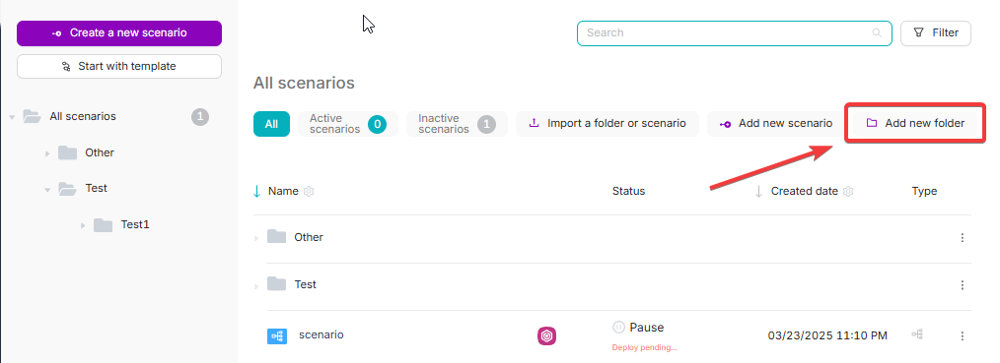

2. Click **Save**.

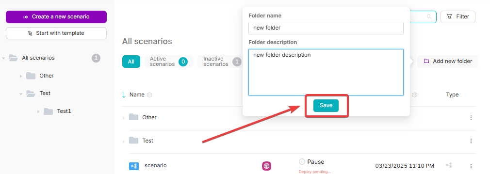

3. In the **All Scenarios** table, open the scenario row menu (**⋯**).

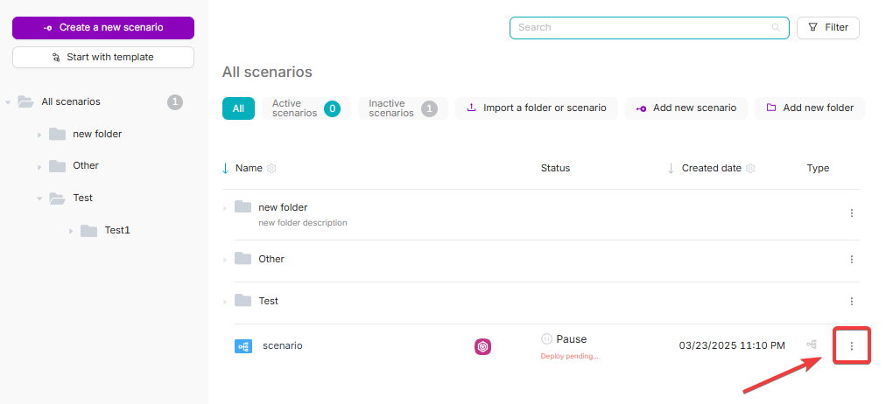

4. Click **Move Scenario** and select the target folder.

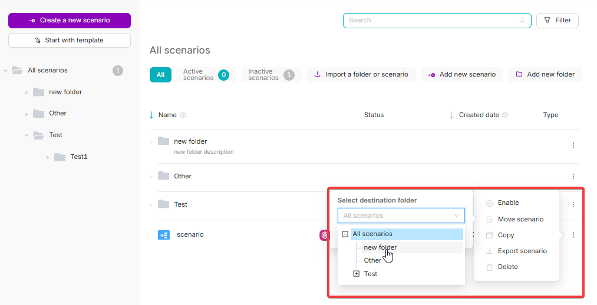

<Callout type="info" title="Subfolders">
You can add subfolders by using **Add new folder** from the parent folder menu.

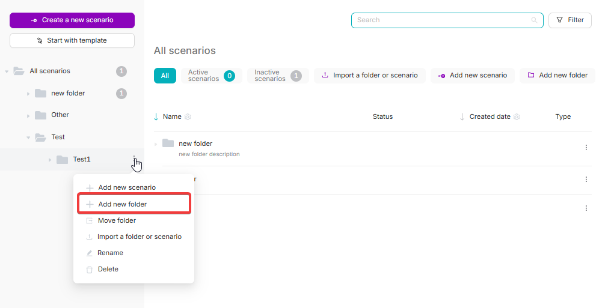
</Callout>

---

## All Scenarios table

You can view key attributes of each scenario in the **All Scenarios** table.

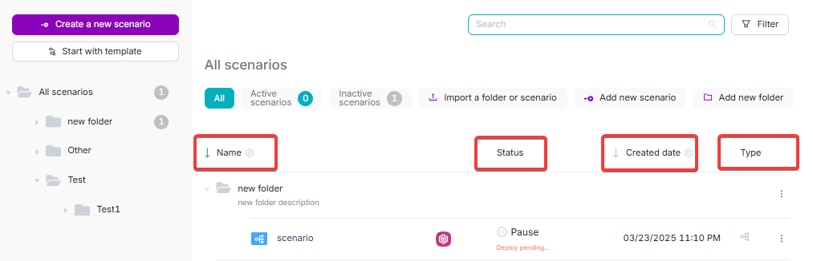

- **Scenario Name**: shown in the **Name** column. You can use the “gear” icon to switch the column to show the scenario’s webhook URL trigger instead of the name.

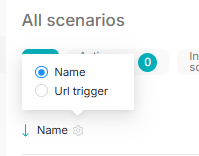

- **Scenario Status**: shown in the **Status** column (for example, **Pause** or **Active**).
- **Scenario Creation Date**: shown in the **Creation Date** column. You can use the “gear” icon to show the modification date instead of the creation date.

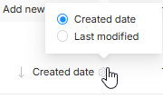

- **Scenario Type**: shown in the **Type** column.
- **Menu**: actions available for each scenario.

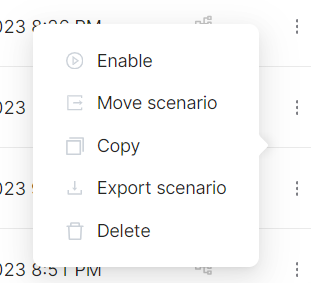

### Scenario menu

The scenario menu allows you to:

- **Enable** or **Disable** a scenario (changes status without opening the scenario).
- **Move** a scenario to a different folder.
- **Copy** a scenario to paste its content into external tools, or into another scenario.

<Callout type="info" title="Related guide">
For details, see [Copying Scenarios and Nodes](./nodes/copy_nodes).
</Callout>

- **Export** a scenario (downloads a JSON file with the scenario content).
- **Delete** a scenario.

<Callout type="warning" title="Delete is permanent">
After you confirm deletion in the modal, the scenario is permanently deleted.
</Callout>

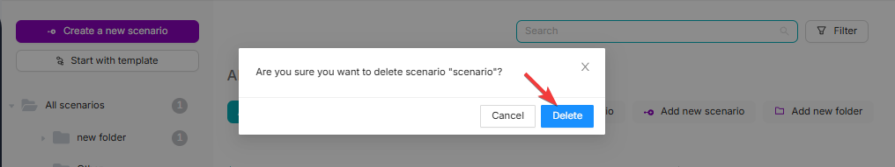

---

## Searching and filtering

### Table filters

Use the filters above the table to show:

- **All**: scenarios in any status
- **Active Scenarios**: only active scenarios
- **Inactive Scenarios**: only paused scenarios

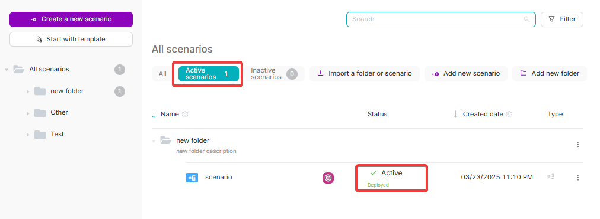

### Search and type filter

At the top of the page, you can use:

- **Search**: type a scenario name
- **Type filter**: filter by scenario type (for example, **All Scenarios**, **Scenario**, **Nodul**)

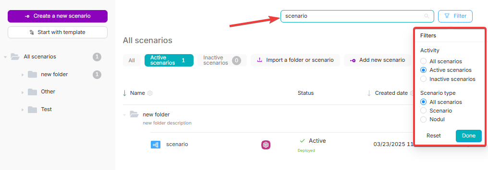

---

## Import & Export (folders and scenarios)

<Callout type="info" title="Related guide">
If you’re looking specifically for transfer steps, see [Import & Export](./scenarios/import_export).
</Callout>

### Export a folder

You can export a folder only if it contains at least one scenario (empty folders can’t be exported).

1. Open the folder menu (next to the folder or from the folder row in the table).

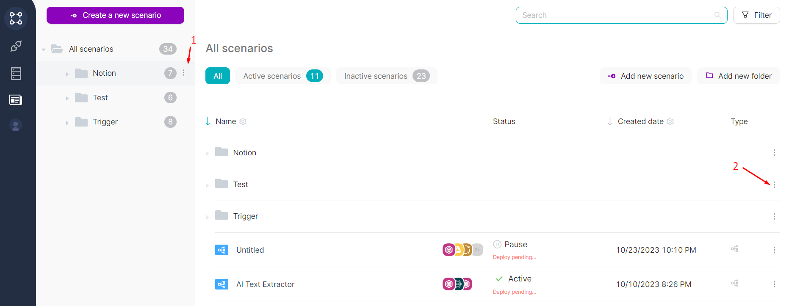

2. Click **Export folder**.

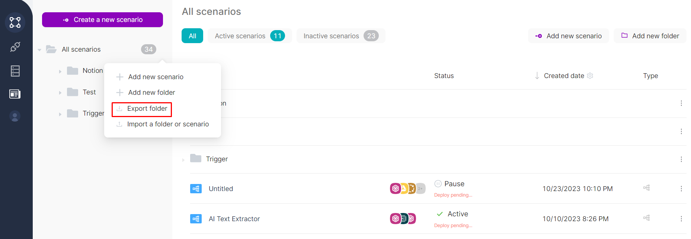

After export, you’ll get an archive that contains folders and scenario JSON files. Folder names and hierarchy are preserved.

### Export a scenario

1. Open the scenario row menu (**⋯**).

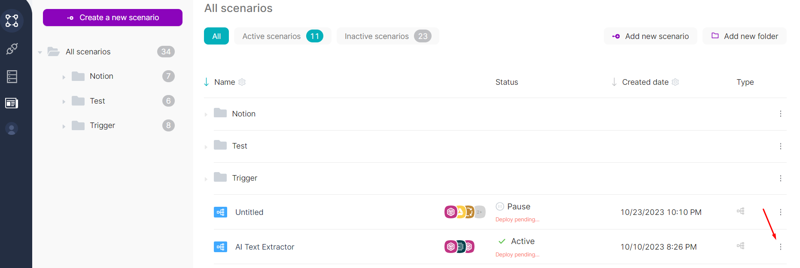

2. Click **Export Scenario**.

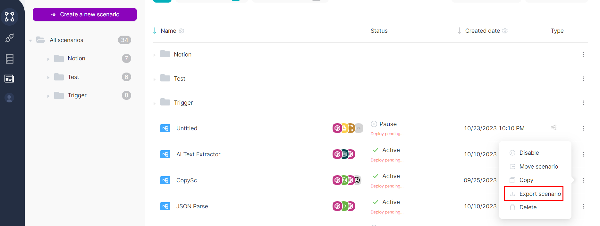

### Import a scenario (or a folder)

You can import into **All Scenarios** or into a specific folder.

1. Open the menu next to **All Scenarios** or next to a folder.

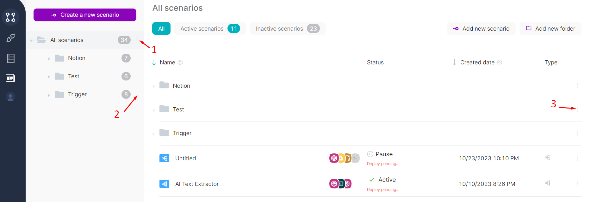

2. Click **Import a folder or scenario**.

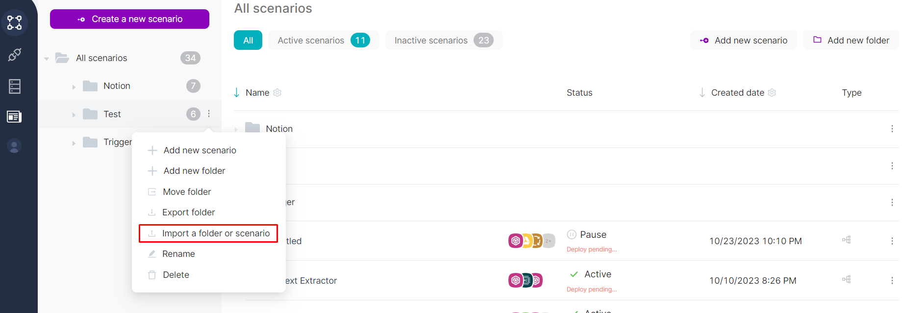

3. Select a file and confirm upload.
4. Verify that the imported scenario appears (by default, it is not active and not published).

<Callout type="info" title="Webhook URL uniqueness check">
When importing a scenario, Latenode checks that the imported **Trigger on Webhook** node is unique by URL. If the URL is not unique, the import won’t proceed.
</Callout>

---

## Creating a scenario

To create a new scenario, click **Create new scenario** (or **Add new scenario**) on the scenarios list page.

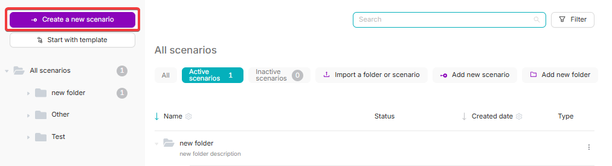

After you click it, Latenode opens the scenario editor.

<Callout type="info" title="Create scenarios inside folders">
You can add scenarios to specific folders by using **Add new scenario** from the folder menu.
</Callout>

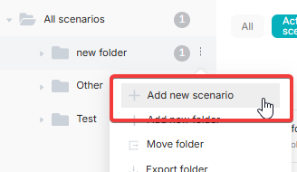

