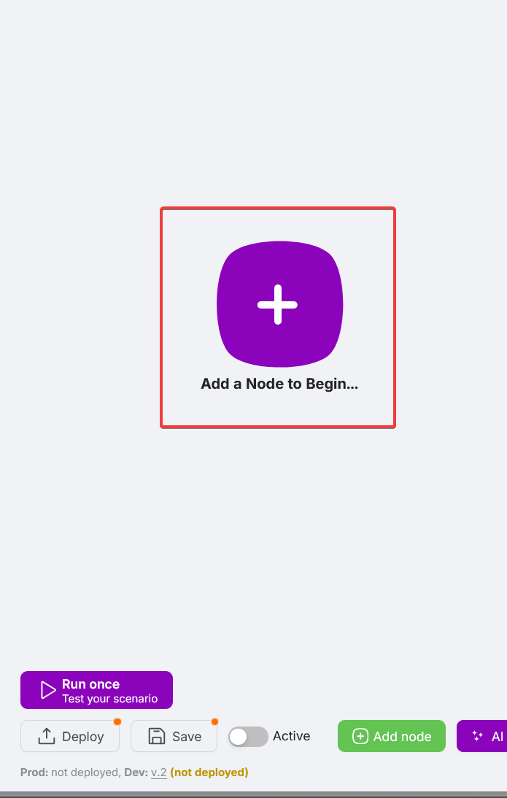
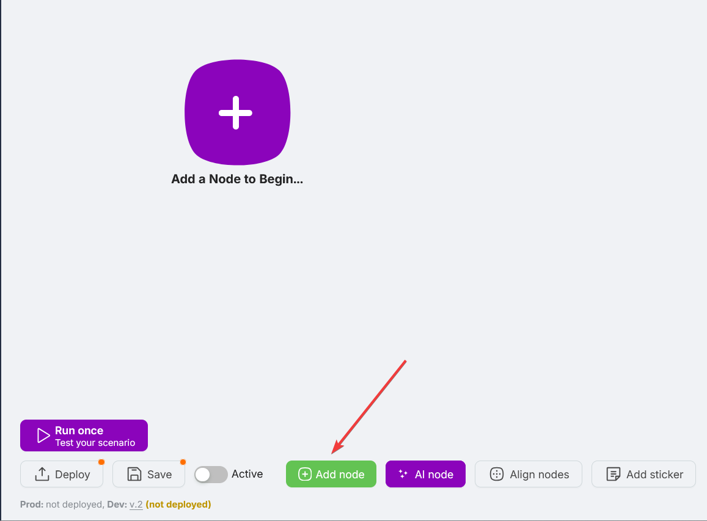
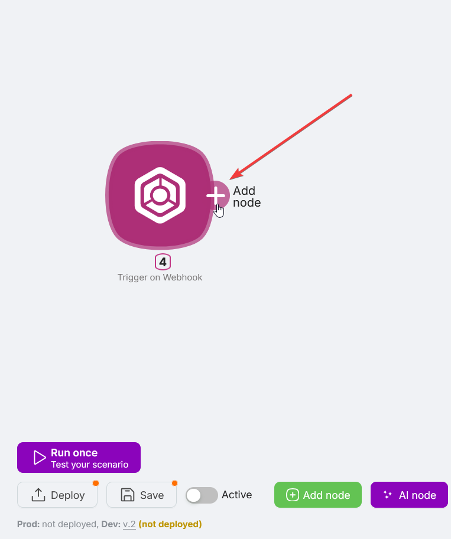
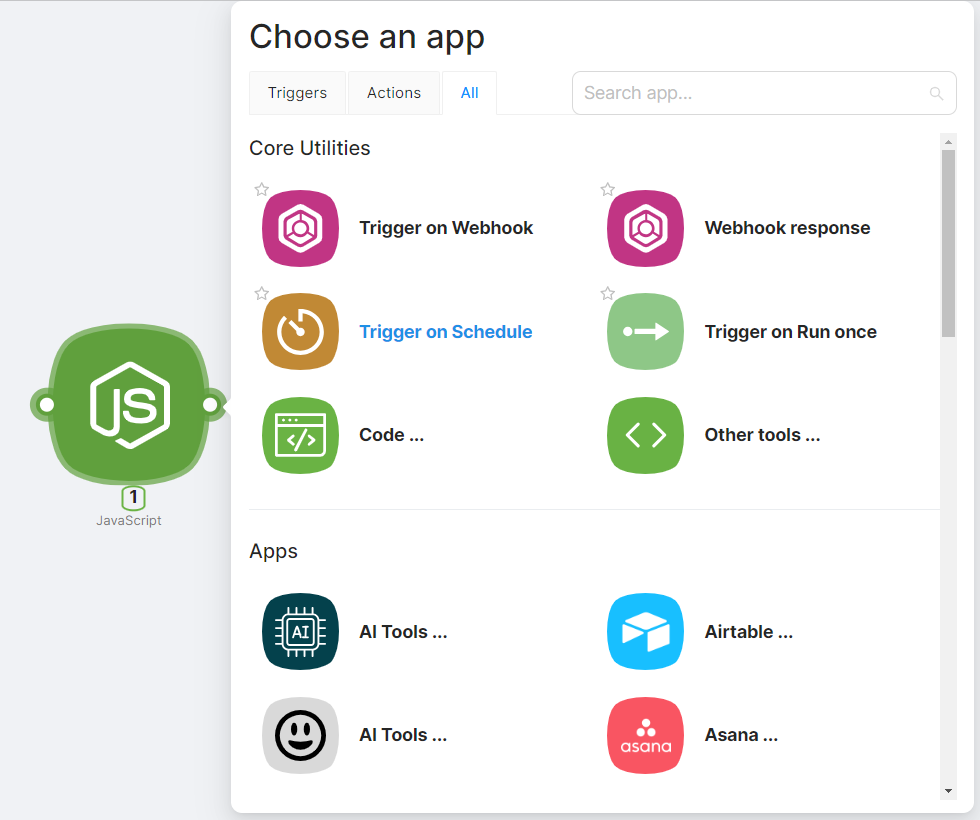

# Add a Node

If your scenario is new and doesn't contain any nodes yet, click **Add Node...** in the center of the canvas to add the first one.

If there are already nodes in the scenario, you can add a new node by:

- Clicking the **Add Node** button in the bottom part of the interface;

- Clicking on the right route point of an already added node.

After clicking **Add Node**, select the desired node from the list in the **Choose an app** window.

## Favorite nodes

To pin frequently used nodes to the top of the **Choose an app** window:

1. Mark the desired node with a "star";

2. Check for the presence of the node in the **Choose an app** window under the **Favorites** section.

If quick access to the node is no longer needed, you can remove the "star" by clicking on it again.

## Search by name

Use the search field at the top of the **Choose an app** window to find a node by name.

