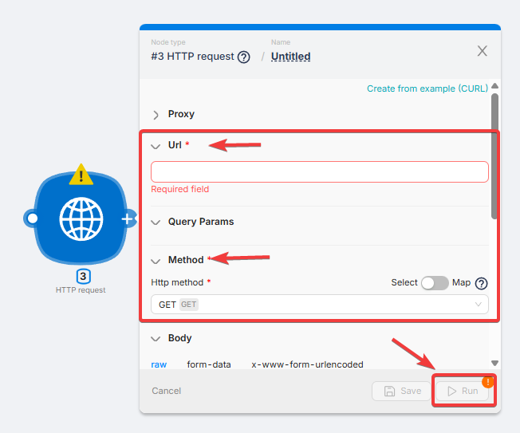
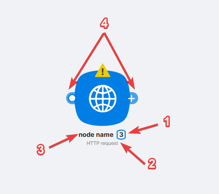
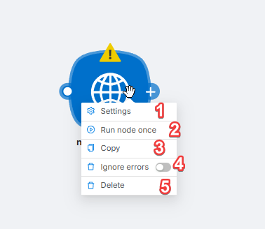

# Configure & Run a Node

## Node Configuration and Execution

After adding a node, you can modify the node's name (**1**) in the settings window and save the changes by clicking the **Save** button (**2**).

When configuring any node, you should:

1. Fill in the mandatory fields (**1**).

<Callout type="warning" title="Note">
The set of fields for configuration is unique to each node.
</Callout>

2. Save the settings and changes by clicking the **Save** button in the node's configuration window.

Each added and configured node is accessible for viewing on the scenario page and displays:

- (**1**) **Node Number** - a unique identifier within the scenario for the node;
- (**2**) **Node Type** - the system name of the node;
- (**3**) **Node Name** - the name entered by the user;
- (**4**) **Route Points** used to create new nodes or routes between nodes.

By right-clicking on a node, a node menu opens with the following buttons:

- (**1**) **Settings** - access the node's settings;
- (**2**) **Run Once** - manually run the node once. Running a node separately allows you to check its functionality without running the entire scenario;
- (**3**) **Copy** - copy the node or selected group of nodes. You can paste:
  - into external tools, such as Notepad;
  - into the interface for creating/editing an existing scenario.
- (**4**) **Ignore Errors** - error handling feature;
- (**5**) **Delete** - delete the node.

