# AI tools

AI tools help you delegate parts of scenario configuration and decision-making to AI systems.

<Callout type="info">
You can use our GPT Assistant for help with **Latenode operators**:

👉 [**Latenode Operators Assistant**](https://chatgpt.com/g/g-67d704425c088191b741075e2b0f9815-latenode-operators-assistant)

It can guide you on writing expressions, using variables, filters, and building logic inside your scenarios.
</Callout>

### Let AI Decide (one-click placeholders)

In most fields where AI Agent or MCP can provide values, you will see a **Let AI Decide** button.
It inserts the correct operator (`fromAIAgent` or `fromMCP`) into the field and auto-generates a suitable parameter name/description.

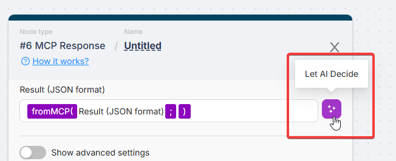

## fromAIAgent()

Use `fromAIAgent()` inside any editable field of a node that is **connected to an AI Agent**.
This marks the field as an argument the agent must provide during execution. The agent sees these placeholders as tool parameters and fills them automatically.

For full context, see: [AI Agent Node](../../ai-agents/ai-agent-node.mdx).

**Format:**

```plain
{{fromAIAgent("parameter_name"; "description")}}
```

**Example:**

```plain
{{fromAIAgent("Email Body"; "Include an email body as either plain text or HTML. If HTML, make sure to set the \"Body Type\" prop to html")}}
```

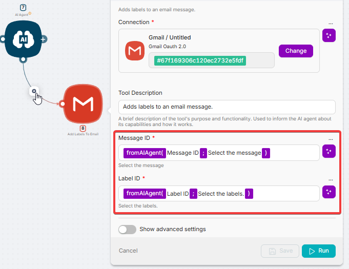

## fromMCP

`fromMCP` is used in MCP workflows to mark inputs and fields that an **MCP client** should decide and fill.
In many places you can also use **Let AI Decide** to insert the correct placeholder automatically.

For setup details, see: [MCP Nodes](../../mcp/mcp_nodes.mdx).

**MCP Trigger input parameters**

In **MCP Trigger → Tool configuration → Input parameters**, add parameters and set:

- **Key**: parameter name (e.g., `email`, `message`)
- **Type**: `fromMCP`
- **Description**: what the AI client should pass

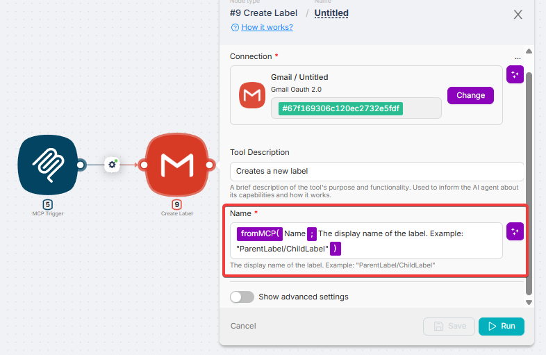

**MCP Response**

By default, MCP returns the output of the last node. **MCP Response** lets you return exactly what the client needs — and you can use **Let AI Decide** to make the response MCP-fillable.

{/* Optional screenshot: MCP Response with Let AI Decide / fromMCP */}

## askAI()

The `askAI()` operator sends a request to the built-in AI and returns a text response.

In addition to text, the request can use existing variables or global variables or output parameters of previous nodes, enclosed in symbols according to the pattern **`"+Variable/Data+"`**.

Below are some examples of using `askAI()`.

<Callout type="warning">
When using artificial intelligence (AI), follow these precautions. Provide clear and understandable instructions to AI to avoid misunderstandings and incorrect results. Verify the accuracy of the AI's responses, especially if they have serious consequences or are critical for decision-making. Remember that AI responses can vary based on input data, model training, and other factors. Be prepared for different outcomes.

</Callout>

### Text Generation

A user request can be a text prompt, such as asking to generate an invitation for an event as the value of the variable **Val**:

1. Add the **Trigger on Run once** and **setvariables** nodes to the scenario.

2. Add the variable **Val** and set its value to **`{{askAI("Generate a short invitation text for an event")}}`**.

3. Run the scenario once and review the node execution results to verify the presence of the new variable.

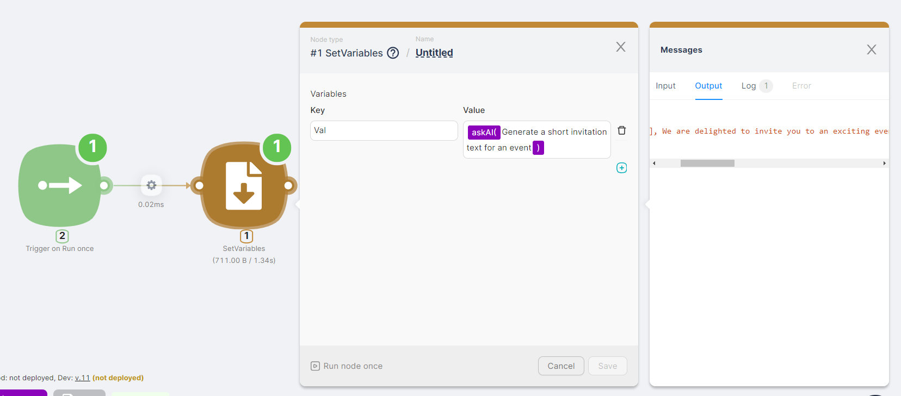

### User Feedback Monitoring

A request can involve identifying the tone or sentiment of incoming text. The text can be the output parameter of a previous node, such as an email or Telegram chat message. For simplicity, generate the text directly within the scenario by adding the following nodes:

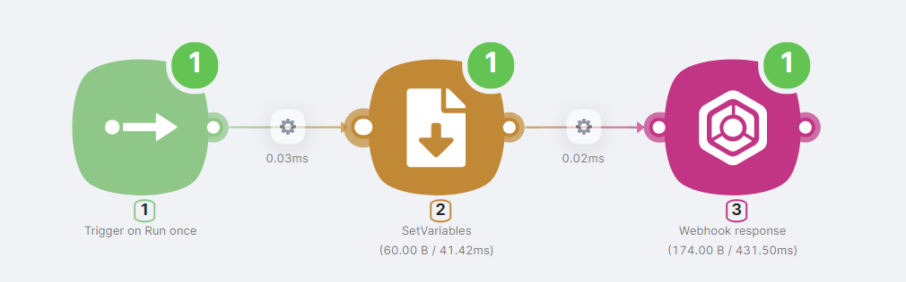

1. **Trigger on Run once** node to trigger the scenario with the **Run once** button.

2. **setvariables** node to generate the **Text** variable, containing the product review text.

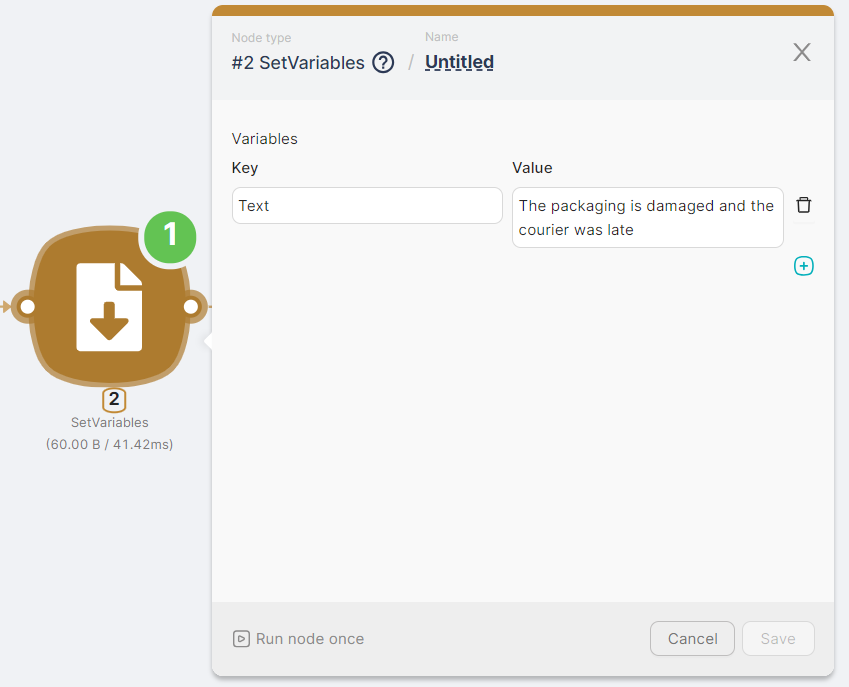

3. **Webhook response** node to return a response upon successful execution of the scenario. In the **Body** field of the **Webhook response** node, add the AI operator with a request using the variable from the **setvariables** node: **`{{askAI("Determine if the text \"" + _.Text + "\" is a negative review")}}`**

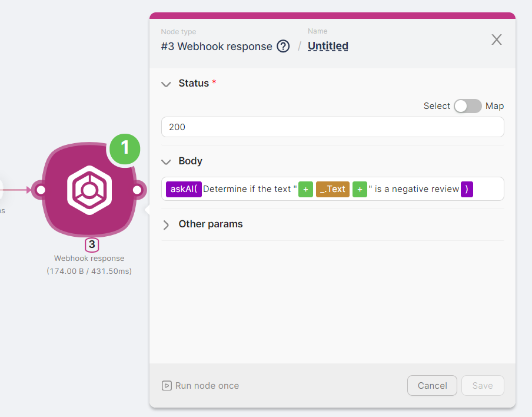

The result of this scenario is an AI response:

***Yes, the text "The packaging is damaged and the courier was late" can be considered a negative review.***

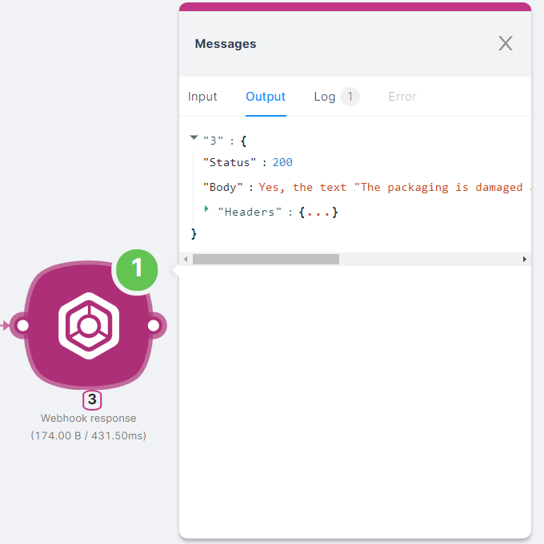

### Text Classification

A request can involve determining if the incoming text is a question. Using the AI operator in routes allows the scenario to follow different branches based on the AI's response.

<Callout type="warning">
Since the condition for route execution is a boolean **TRUE** in the **Condition** field, you must configure this field correctly. For example, ask the AI to return "true" or "false" and compare the result to "true." The equality true=true will be **TRUE**, triggering the route.

</Callout>
For simplicity, generate the text directly within the scenario by adding the following nodes:

1. **Trigger on Run once** node to trigger the scenario with the **Run once** button.

2. **setvariables** node to generate the **Value** variable containing the text for classification.

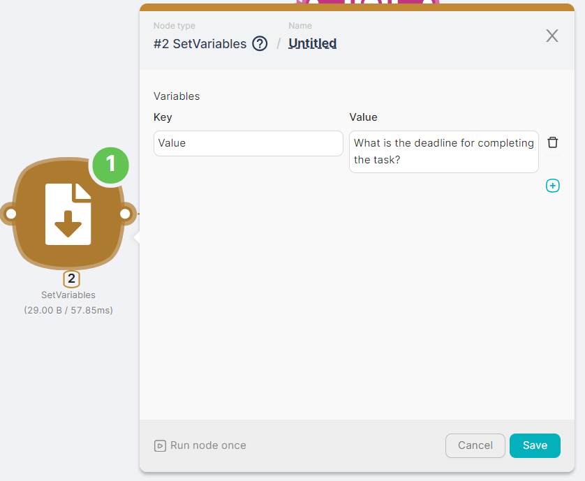

3. **Question** route with the condition **`{{askAI("The text contains \"" + $2.Value + "\" is there a question? If so, return one word \"true\", otherwise return one word \"false\"") = "true"}}`**.

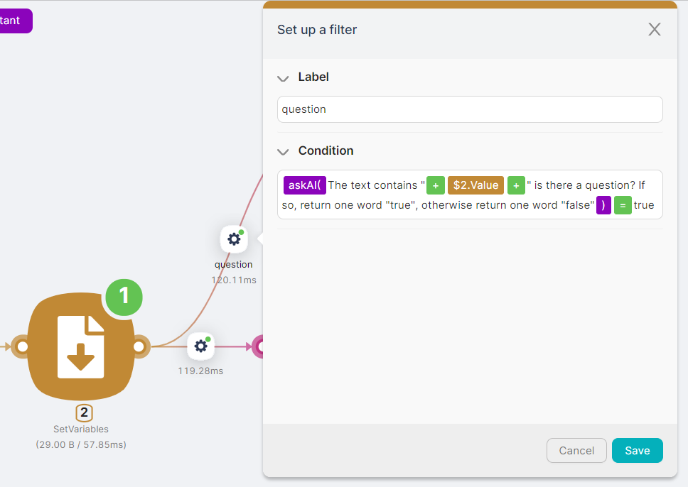

4. **Webhook response** node for the **Question** route with the response *The text contains a question* upon scenario execution.

5. **Not a question** route with the condition **`{{askAI("The text contains \"" + $2.Value + "\" is there a question? If not, return one word \"true\", otherwise return one word \"false\"") = "true"}}`**.

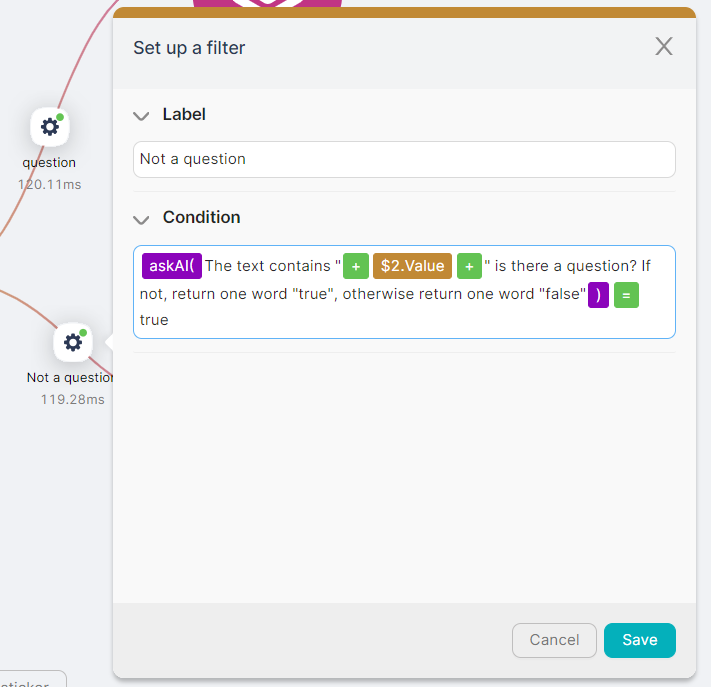

6. **Webhook response** node for the **Not a question** route with the response *The text does not contain a question* upon scenario execution.

The result of the scenario depends on the text in the **Value** variable:

- If the variable contains a question, such as *What is the deadline for completing the task?*, the scenario's result is *The text contains a question*.

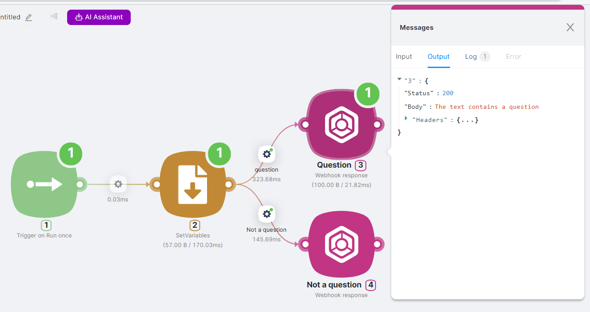

- If the variable contains a statement, such as *Documentation is an important part of learning*, the scenario's result is *The text does not contain a question*.

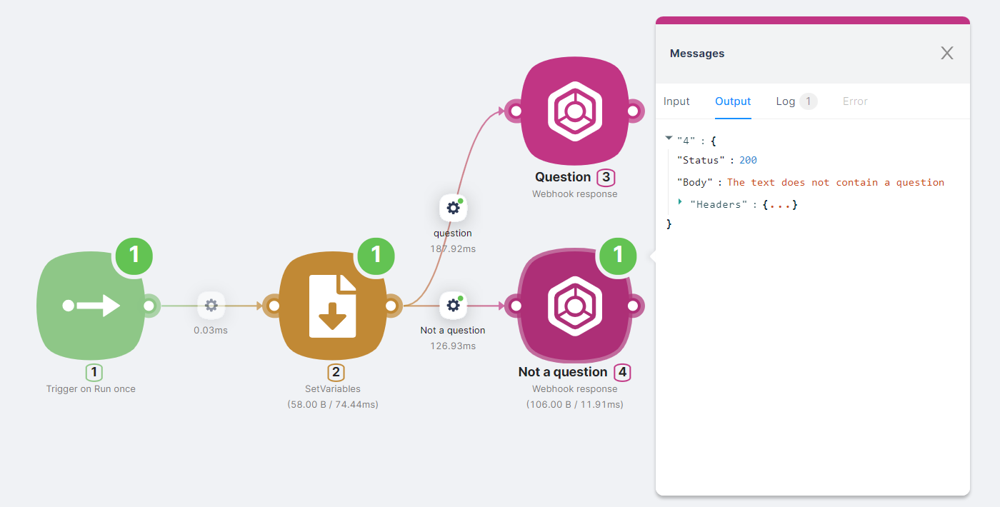
