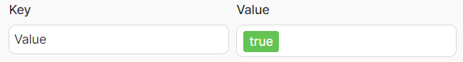
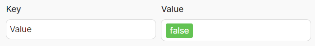
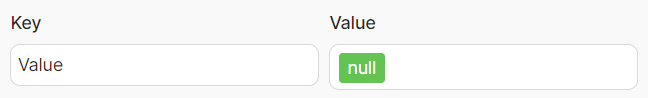

# Key Fields

<Callout type="info">
You can use our GPT Assistant for help with **Latenode operators**:

?? [**Latenode Operators Assistant**](https://chatgpt.com/g/g-67d704425c088191b741075e2b0f9815-latenode-operators-assistant)

It can guide you on writing expressions, using variables, filters, and building logic inside your scenarios.

</Callout>
## Algorithm

Operators in this group ensure the presence of certain values in a field, variable, or expression.

## Result

## true

The result of the execution is the presence of a boolean value **TRUE**.  

## false

The result of the execution is the presence of a boolean value **FALSE**.  

## null

The result of the execution is the presence of **null**.  

## space

The result of the execution is the presence of a **space**.  

- **Example:** If 3.ValueSV = "Hello" and 3.ValueSV = "Latenode", then "Hello Latenode".  
