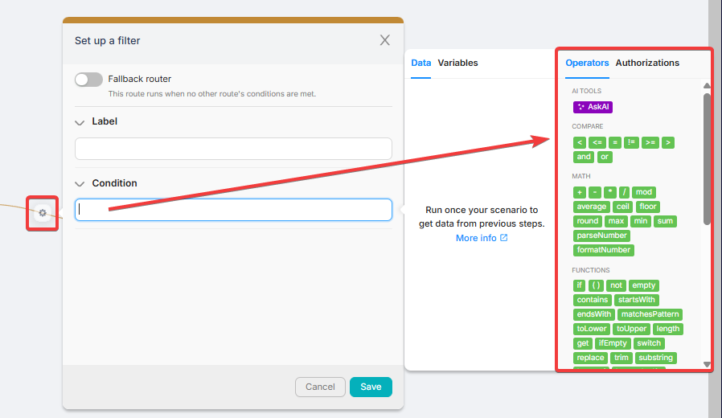
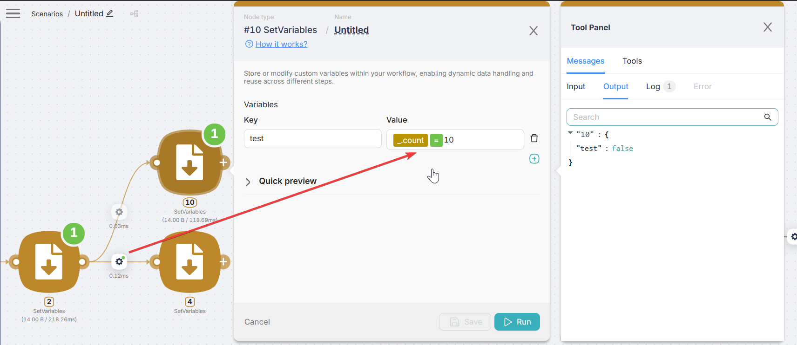

# Operators Basics

Operators in Latenode are like formulas in spreadsheets: they take input data and return a result.

## Using operators to modify data

You can use operators in almost any input field across nodes to transform data before sending it next:

- Build or modify text (replace ,concatenate, trim, case conversion)
- Do math and formatting
- Extract values from JSON/arrays
- Apply conditional logic (choose one value or another)

## Using operators in routes

Routes use operators for **filtering and branching**.
When operators are used in **Route > Condition**, the condition must evaluate to a boolean: **TRUE** or **FALSE**.

### The result of any route filter is TRUE or FALSE
- If the filter condition is **TRUE**, the scenario execution continues through that route.
- If the filter condition is **FALSE**, that route is not selected and execution does not go there.

### Fallback route 

A fallback route triggers **only if none of the outgoing routes from the node evaluates to TRUE**.

Read more: [Fallback routes](../routes.mdx#fallback-routes)

### How to test and debug any filter 

You can test any route filter by copying the same formula into a separate **Set Variables** node in a neighboring branch.

This makes debugging easier because you can see:

- the input values used by the expression
- the final result of the filter as **true/false** in the node output

**Example:** copy the route condition into Set Variables and store it into a variable (e.g. `test`) � then check the output.

