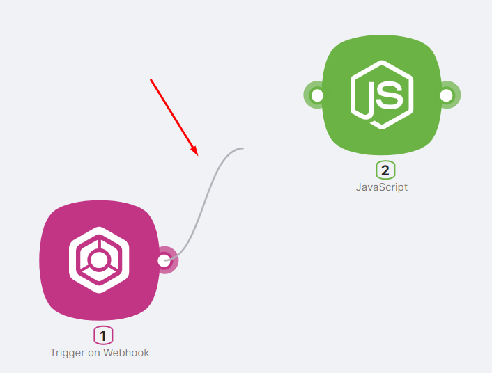
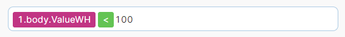
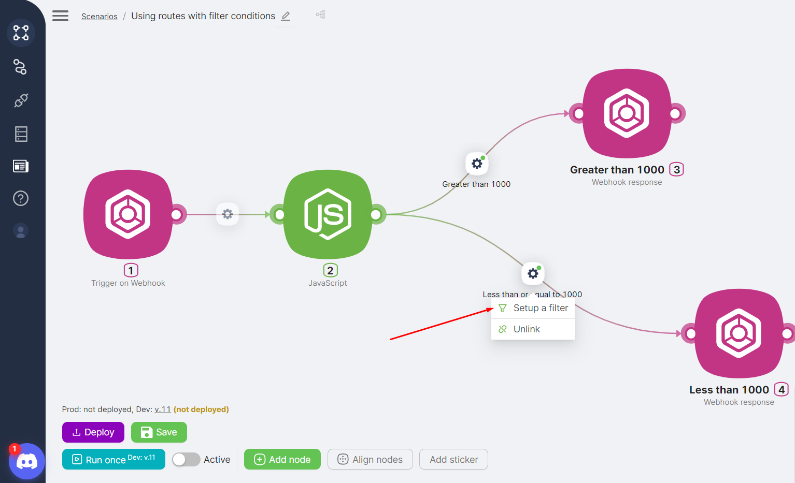
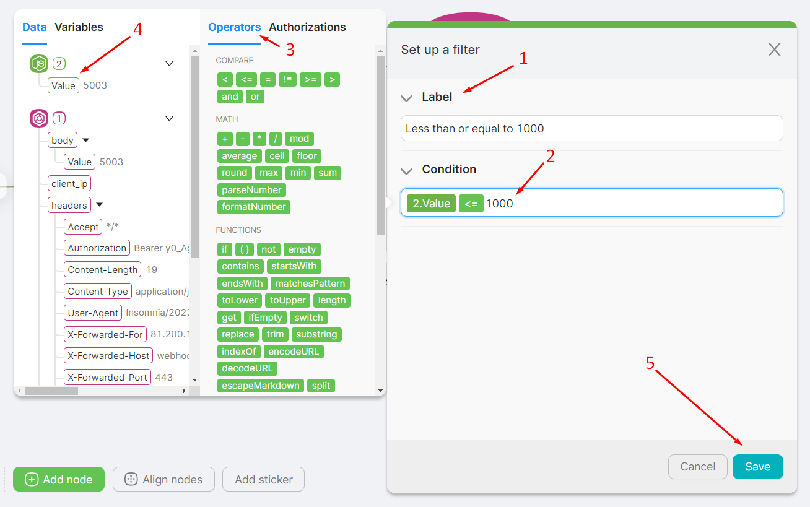

# Routes

The platform has no dedicated router or merger nodes. To branch scenario execution or merge branches back together, you simply connect nodes with **routes** (connectors)—from one route point to another. Below is how to add routes and set conditions.

## Adding a Route

If a node is added through the **route point** of an existing node, a route between these nodes is established automatically.

If a node is added through the **Add Node** button, you should set up the route manually by connecting the two route points of the desired nodes in the correct direction.

## Route Configuration, Conditions

<Callout type="info">
 When there are multiple routes through which the scenario can proceed, the route with a value of **TRUE** in the **Condition** field will be chosen.

</Callout>

**Example of a route** with a **Condition** value of **TRUE**:

- If 1.body.ValueWH = 45, then TRUE;  
- If 1.body.ValueWH = 125, then FALSE.  

After adding the **route**, you can access its settings by clicking the **Setup a filter** button.

In the **route** configuration window, you can:

- Change the route name in the **Name** field (**1**)  
- Enter filter conditions in the **Condition** field (**2**), selecting logical operators for expressions in the **Operators** window (**3**) and values/parameters from previous nodes in the **Data** window (**4**)  
- Save the changes by clicking the **Save** button (**5**)  

## Fallback routes

A fallback route (reserve route) triggers **only when none of the outgoing routes from the node evaluates to TRUE**.

- At least one route is TRUE → execution continues through the matching route.
- All routes are FALSE → the fallback route is triggered (if configured).
- If no fallback route is configured → the scenario may stop at that node (because there is no valid next route).

<Callout type="info">
 See also [Building scenarios](/visual-builder/scenarios/building-scenarios) for scenario examples using conditions in routes

</Callout>