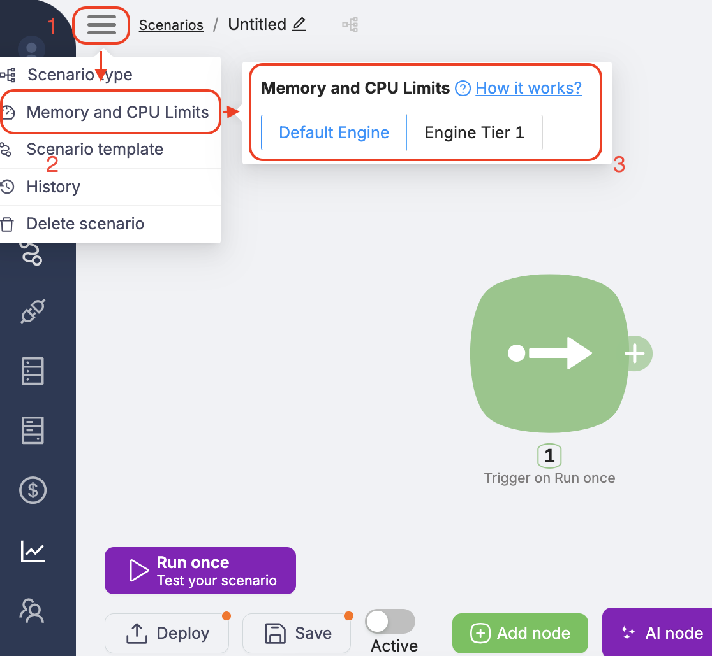

# Enhanced Compute Resources (Engine Tier 1)

## What is this?

We've added the ability to run scenarios using an `engine` with increased compute resources. This can be useful in situations where the standard resource allocation is insufficient for successful scenario execution.

---

## Why is this needed?

By default, scenarios execute in a standard environment (**Default**), which is suitable for most use cases.

However, in some cases, the following problem may occur:

> Your scenario doesn't have enough resources, specifically RAM.

Using **Engine Tier 1** allows you to run such scenarios in an environment with enhanced resources.

---

## How does it work?

When running a scenario, you can specify the `engine_type` parameter to select the desired configuration:

- **Default** — standard engine (used by default)
- **Engine tier 1** — engine with increased compute resources

---

## How much does it cost?

Using **Engine Tier 1** is billed separately.

<Callout type="warn">
**Engine Tier 1 doubles the cost of scenario execution. In other words, running a scenario with Engine Tier 1 will cost twice as much as running it in Default mode.**
</Callout>

This is because the system allocates additional infrastructure resources to support such executions.

---

## When should you use Engine Tier 1?

We recommend using **Engine Tier 1** if:

- your scenario is unstable in the standard environment;
- you see errors related to resource limits (e.g., Out of Memory);
- you know your scenario requires more RAM or CPU than usual;
- you're willing to pay for increased resource consumption.

---

## Frequently Asked Questions

**What resources are allocated for Engine Tier 1?**

We don't disclose specific technical parameters, as configurations may change. The main goal is to ensure successful execution of scenarios that exceed standard resource limits.

**Can I choose the engine type for each scenario?**

Yes. You can select the engine mode for each scenario by setting the appropriate value in the `engine_type` parameter.

---

## Troubleshooting

If your scenario fails with an error like:

> Scenario execution needs more CPU/RAM resources. Try switching Memory and CPU Limits to Tier-1.

try restarting it with **Engine Tier 1**.

In most cases, such errors are caused by resource exhaustion (e.g., memory or CPU limits). Switching to an engine with enhanced resources typically resolves the issue.

<Callout type="warn">
Engine Tier 1 increases all available resources, **except for the 32 MB file size limit**, which remains unchanged. If you need to work with larger files, we recommend providing them via public URLs (e.g., file sharing services) instead of direct upload.
</Callout>
