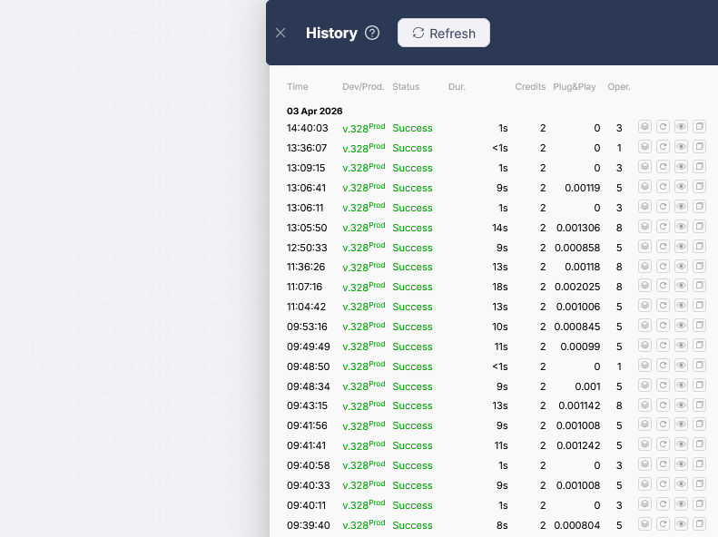
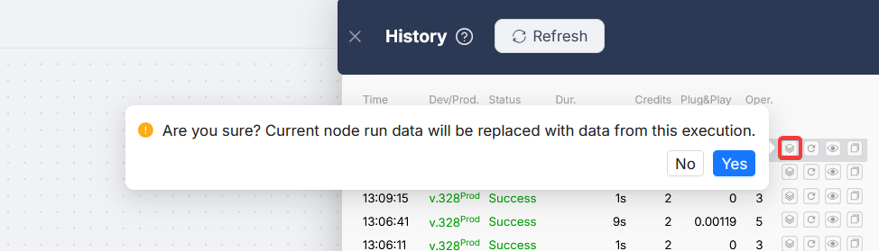
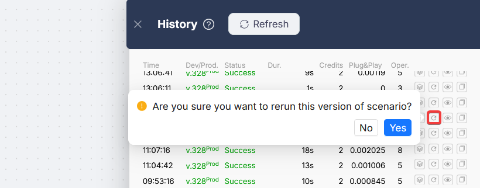
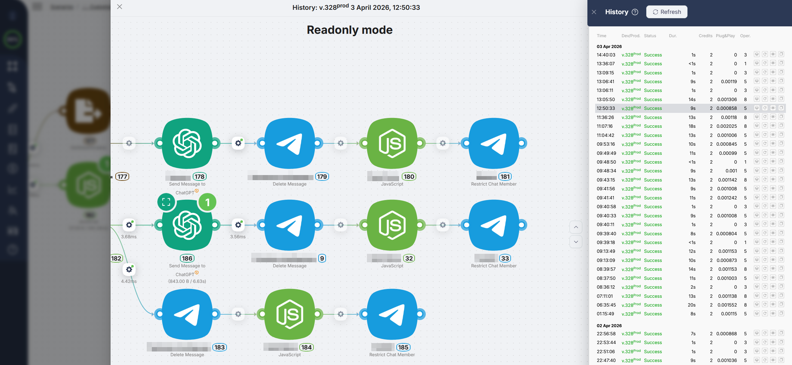

# Execution History

Execution History is a log of every scenario run. It lets you see what happened in each run: which nodes executed, what data passed through them, and where an error occurred. Open it by clicking the **History** button in the visual builder toolbar.

<Callout type="info">
If the history table is empty, the scenario has not run yet. To make a test run, use [One-time Scenario Execution](../../../integrations/core-nodes/trigger-on-run-once.mdx).
</Callout>

## Run list

Every run, successful or not, appears as a row in the history table. Each row has four action icons on the right side.

| Column | What it shows |
|--------|---------------|
| **Time** | When the run started |
| **Dev/Prod** | Scenario version and branch, e.g. `v.590Prod` or `v.12Dev` |
| **Status** | Run result (see table below) |
| **Dur.** | How long the run took |
| **Credits** | Execution credits consumed |
| **Plug&Play** | Plug&Play tokens consumed |
| **Oper.** | Number of operations executed inside the run |

**Run statuses:**

| Status | Meaning |
|--------|---------|
| **Success** | The scenario completed without errors |
| **Error** | An error occurred during execution |
| **Pause** | The scenario is paused at a Wait node |
| **Canceled** | The scenario was canceled |

## Use Execution Data

The **Use Execution Data** button (the first icon) loads output data from any past run directly onto the current Dev canvas, without re-executing the scenario.

If a previous run produced real data you want to work with, you can pull it straight into your Dev environment and use it as the starting point for further testing or development — without re-running the full scenario.

<video autoPlay muted loop playsInline width="100%">
  <source src="/assets/videos/execution-history-use-data.mp4" type="video/mp4" />
</video>

**Typical use case:** you added a new node to an existing scenario. Instead of triggering the whole flow again to get data into upstream nodes, you copy the data from a previous execution and run only the new node against it.

1. Open the History panel and find the run whose data you want to reuse
2. Click the **Use Execution Data** icon on that row
3. Confirm in the dialog - you'll be warned that current node data on the canvas will be replaced
4. Data is applied only to nodes that exist both in the selected run and on the current canvas

After applying, the canvas behaves as if those nodes had just executed. You can run any downstream node immediately using the copied values as input.

<Callout type="info">
Each time you apply execution data, the existing node data on the canvas is overwritten. The action applies only to nodes present in both the selected execution and the current scenario.
</Callout>

## Restarting a run

The second button re-runs the scenario using the exact same trigger data it received during the original run.

This is useful for debugging: no need to wait for a real trigger event. You can replay a specific run as many times as needed. Each restart creates a new entry in the history.

## Viewing a run

The third button opens the run in **Readonly mode**: the scenario as it looked during that specific execution. Every node shows its status, notifications, and any errors that occurred.

Clicking any node opens its data panel. Switch between the incoming and outgoing data tabs, and expand nested objects to inspect specific values.

### Navigating between runs

While viewing a run in Readonly mode, use the **↑↓** buttons in the history panel to move to the previous or next run without closing the current view.

<video src="/assets/videos/execution-history-navigation.mp4" autoPlay controls loop muted playsInline style={{width: '100%', borderRadius: '8px'}} />

When you switch runs, the following state is preserved:

- position of the scenario canvas in the history window
- open node output panel
- selected tab (incoming / outgoing data)
- scroll position inside the data panel
- object nesting state (expanded/collapsed)

This makes debugging faster: you can step through recent runs and compare how data changed from one execution to the next.

## Copy run link

The fourth button copies a direct URL to that specific run. Useful for referencing it internally or sending to support.
