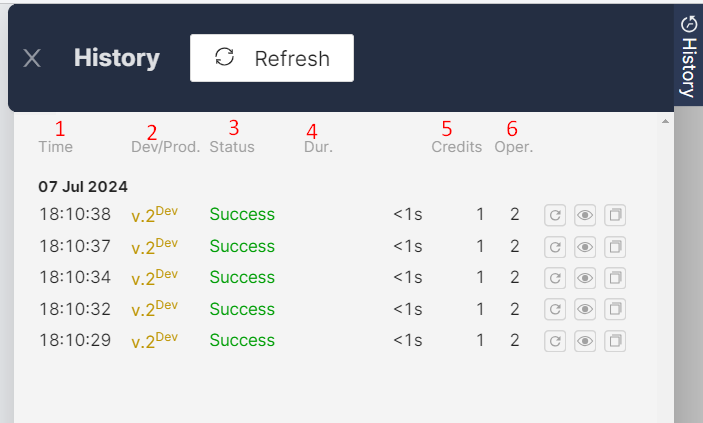
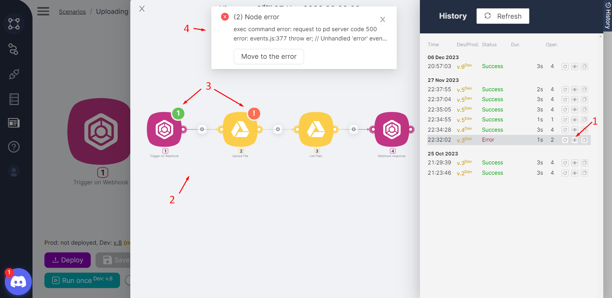
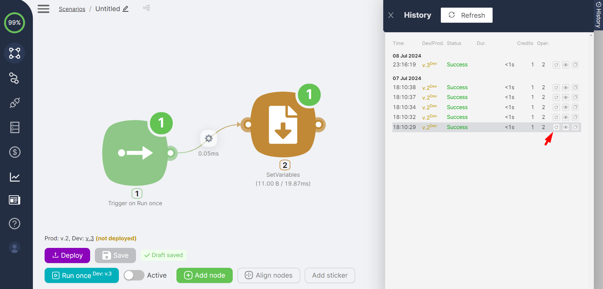

# Execution History

<Callout type="info">
If the history table is empty, you need to run the scenario. For more on running a scenario once, see [One-time Scenario Execution](../../../integrations/core-nodes/trigger-on-run-once.mdx).
</Callout>

Each scenario run (successful or unsuccessful) is recorded in history. The history table is accessible by clicking the **History** button. The table displays key information about the scenario:

- **(1)** **Time** the scenario started;
- **(2)** **Branch** (Development or Production) of the executed scenario, including the version, e.g., v.13 Dev;
- **(3)** **Status** of scenario execution:

**Success** — if the scenario completed fully
**Error** — if errors occurred during the scenario
**Paused** — if the scenario is at the Wait node execution stage
**New** — if the scenario was stopped by clicking the **Stop** button

- **(4)** **Duration** of scenario execution in seconds;
- **(5)** Number of **credits** consumed by the scenario;
- **(6)** Number of **operations** performed in the scenario.

### Viewing the Scenario

Each scenario run record has a **View** button. Clicking the **View** button **(1)** displays the nodes **(2)** and their notifications **(3)** for the selected scenario version. If the scenario failed with an error, error information is displayed **(4)**.

### Restarting the Scenario

Each scenario run record has a **Restart** button. Clicking the **Restart** button:

- Initiates a re-run identical to the selected scenario version and input data
- Creates a new entry in history

<Callout type="info">
You can also copy a scenario execution from history.
</Callout>
