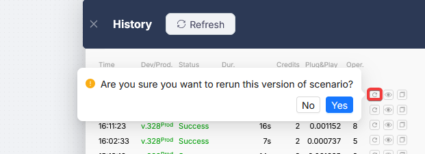

# Execution History

Execution History is a log of every scenario run. It lets you see what happened in each run: which nodes executed, what data passed through them, and where an error occurred. Open it by clicking the **History** button in the visual builder toolbar.

<Callout type="info">
If the history table is empty, the scenario has not run yet. To make a test run, use [One-time Scenario Execution](../../../integrations/core-nodes/trigger-on-run-once.mdx).
</Callout>

## Run list

Every run, successful or not, appears as a row in the history table.

| Column | What it shows |
|--------|---------------|
| **Time** | When the run started |
| **Dev/Prod** | Scenario version and branch, e.g. `v.590Prod` or `v.12Dev` |
| **Status** | Run result (see table below) |
| **Dur.** | How long the run took |
| **Credits** | Execution credits consumed |
| **Plug&Play** | Plug&Play tokens consumed |
| **Oper.** | Number of operations executed inside the run |

**Run statuses:**

| Status | Meaning |
|--------|---------|
| **Success** | The scenario completed without errors |
| **Error** | An error occurred during execution |
| **Pause** | The scenario is paused at a Wait node |
| **Canceled** | The scenario was canceled |

## Viewing a run

Click the eye icon on any row to open the run in **Readonly mode**: the scenario as it looked during that specific execution. Every node shows its status, notifications, and any errors that occurred.

Click any node to open its data panel. Switch between the incoming and outgoing data tabs, and expand nested objects to inspect specific values.

## Navigating between runs

While viewing a run in Readonly mode, use the **↑↓** buttons in the history panel to move to the previous or next run, without closing the current view.

<video src="/assets/videos/execution-history-navigation.mp4" autoPlay controls loop muted playsInline style={{width: '100%', borderRadius: '8px'}} />

When you switch runs, the following state is preserved:

- position of the scenario canvas in the history window
- open node output panel
- selected tab (incoming / outgoing data)
- scroll position inside the data panel
- object nesting state (expanded/collapsed)

This makes debugging faster: you can step through recent runs and compare how data changed from one execution to the next.

## Restarting a run

Click the restart icon on any row. The scenario will re-run using the exact same trigger data it received during the original run.

This is useful for debugging: no need to wait for a real trigger event. You can replay a specific run as many times as needed. Each restart creates a new entry in the history.

## Copy run link

The link icon copies a direct URL to a specific run, useful for referencing it internally or sending to support.
