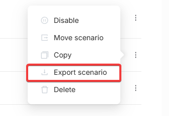
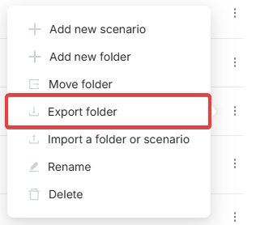
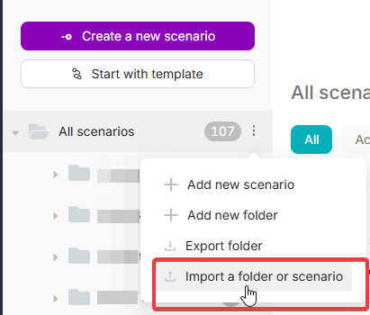
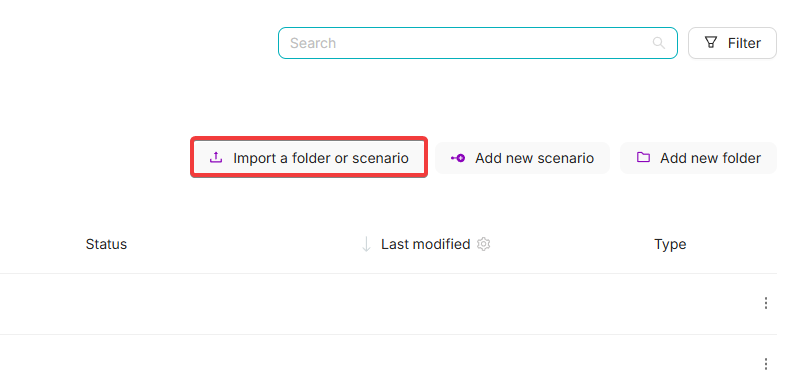

# Import and Export

## Export

### Export Scenario

Next to each scenario, open the context menu (**?**) and select **Export scenario**. This will download the scenario as a JSON file.

### Export Folder

In the context menu next to any folder, select **Export folder** to export the entire folder as an archive. The archive includes all nested folders and scenarios.

---

## Import

### Import to a Specific Folder

In the context menu of any folder, select **Import a folder or scenario** to upload previously exported files directly into that folder.

### Import from Top Menu

You can also use **Import a folder or scenario** in the top toolbar to import files into the root directory or the currently selected folder.

---

## Migrating All Scenarios Between Accounts

To transfer **all your scenarios** from one account to another:

1. Move all scenarios into a single folder.
2. Use **Export folder** to export the folder as an archive.
3. Log in to the target account and use **Import a folder or scenario** to upload the archive.
4. Recreate and reconnect all **authorizations** (tokens, API keys, etc.) manually � they are not transferred with the scenarios.
